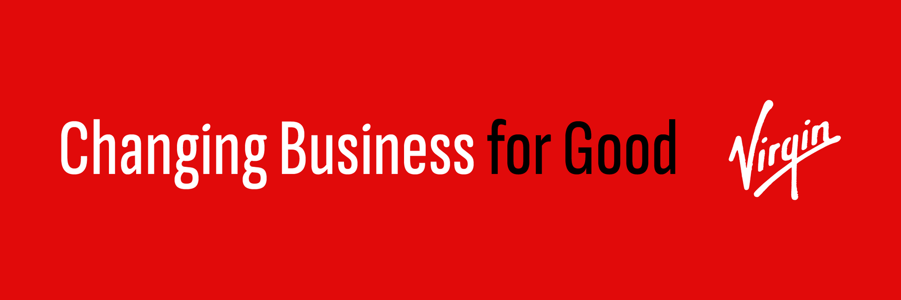
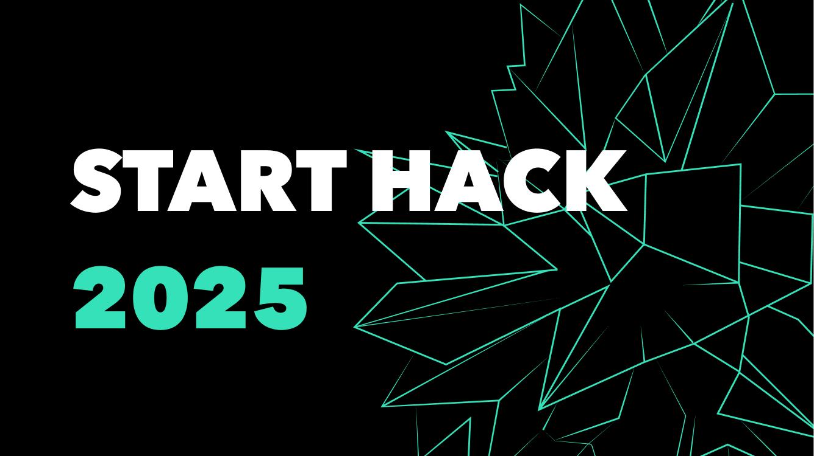

# Virgin Initiatives Hub

## Hackathon Submission for START Hack 2025
### Team fold
**Members**: Oliver Birringer, Felix Fidler, Dominik Rzecki, Luka Milenkovic

This project presents an innovative two-part solution for connecting Virgin's sustainability initiatives with interested stakeholders: a mobile customer application and a desktop dashboard for employees.

## 🌍 Project Overview

Virgin Initiatives Hub seamlessly bridges the gap between Virgin's diverse sustainability efforts and individuals looking to engage with meaningful initiatives. By leveraging interactive visualizations, personalized matching algorithms, and engaging interfaces, we create a platform that makes discovering and participating in sustainability initiatives intuitive and rewarding.

## 📹 Demo Video

*Click to watch our project demonstration*

## ✨ Key Features

### 📱 Mobile Customer App

The mobile application focuses on connecting users with Virgin initiatives that align with their personal values and interests:

- **Interactive Global Explorer**: Navigate an immersive 3D globe showcasing Virgin's global sustainability initiatives across different business units
- **Interest-Based Matching**: Swipe through sustainability topics to discover initiatives that align with personal values
- **Smart Recommendations**: Receive personalized initiative suggestions based on interaction history and preferences
- **Project Details**: Access comprehensive information about each initiative, including challenges, descriptions, and impact
- **Gamification Elements**: Earn sustainability points and badges for engagement with initiatives
- **Community Features**: Connect with like-minded individuals through discussion forums and events
- **Impact Visualization**: Track personal sustainability contributions through an intuitive dashboard

### 💻 Desktop Employee Dashboard

The desktop dashboard equips Virgin employees with powerful tools to monitor and manage sustainability initiatives:

- **Interactive Data Visualization**: Real-time global view of initiative engagement and impact metrics
- **Geographical Insights**: Identify geographical patterns in user engagement through the interactive globe interface
- **Initiative Management**: Add, edit, and monitor sustainability projects across Virgin's business units
- **User Engagement Analytics**: Track how customers interact with different initiatives over time
- **Impact Reporting**: Generate comprehensive reports on sustainability outcomes and engagement metrics
- **Resource Allocation**: Make data-driven decisions on where to focus sustainability efforts based on user interest

## 🚀 Technology Stack

- React.js for responsive front-end interfaces
- Three.js for 3D globe visualization and interactive elements
- TypeScript for type-safe code development
- CSS with adaptive design principles for cross-platform compatibility
- React Three Fiber for declarative 3D scene management

## 🏆 Value Proposition

The Virgin Initiatives Hub transforms how sustainability initiatives connect with interested individuals:

- **For Customers**: Discover meaningful initiatives that align with personal values while tracking your positive impact
- **For Virgin**: Gain valuable insights into customer interests, optimize resource allocation, and increase engagement with sustainability initiatives
- **For the Planet**: Accelerate positive environmental and social impact by connecting the right initiatives with the right people

---

*This project was developed for START Hack 2025 as a conceptual demonstration of how technology can bridge the gap between sustainability initiatives and interested stakeholders.*
